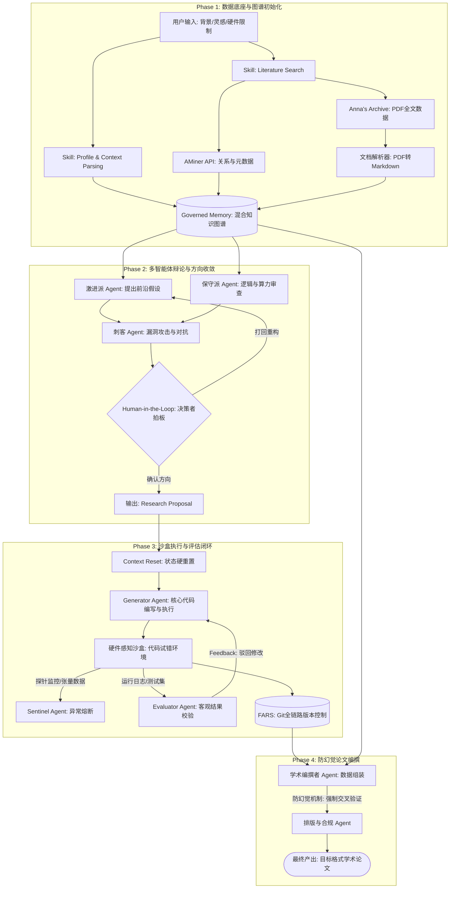

# 系统架构

## 整体架构图



## 核心组件

### 1. Governed Memory (治理记忆层)

基于 [personizeai/governed-memory](https://github.com/personizeai/governed-memory) 的双态记忆模型：

- **强 Schema 约束的类型化属性**：硬约束条件（如硬件限制、研究方向）
- **开放集原子事实**：动态上下文（如最新文献、实验日志）

### 2. 多智能体辩论系统

参考 AutoResearchClaw 的对抗机制：

| Agent | 角色 | 职责 |
|-------|------|------|
| 激进派 | Hypothesis Agent | 提出反直觉、冒进的研究假设 |
| 保守派 | Sanity Agent | 验证假设的物理/数学自洽性 |
| 刺客 | Killer Agent | 以审稿人视角攻击假设薄弱点 |

### 3. 硬件感知沙盒

- 自动探测本地计算环境
- 评估算力底座，决定实验规模
- 注入探针监控执行过程

### 4. Generator-Evaluator 闭环

参考 Anthropic Harness 设计：

- **物理隔离**：执行者与评估者完全独立
- **客观评估**：基于真实探针数据，而非代码文本
- **无情驳回**：不达标即刻回滚

### 5. 防幻觉验证层

- **引用验证**：仅允许引用知识图谱中真实存在的文献
- **数据验证**：图表必须来源于 Git 仓库中的真实日志
- **强制 Grounding**：100% 可追溯性

## 技术栈

| 层级 | 技术选型 |
|------|---------|
| LLM 接口 | OpenAI API / Anthropic API |
| 向量数据库 | Chroma / FAISS / Milvus |
| 知识图谱 | Neo4j / NetworkX |
| 沙盒环境 | Docker / Firecracker |
| 版本控制 | Git / GitLab |
| PDF 解析 | Nougat / Marker / Grobid |
| 文献检索 | AMiner API / arXiv API |

## 数据流

```
用户输入 → Profile Parsing → 知识图谱初始化
                ↓
         文献检索 → PDF下载 → OCR解析 → 知识图谱
                ↓
         多智能体辩论 → Research Proposal
                ↓
         上下文重置 → 代码执行沙盒
                ↓
         探针监控 → 客观评估 → 迭代/通过
                ↓
         论文编撰 → 格式校验 → 最终产出
```

## 设计原则

1. **状态机流转**：阶段间严格校验，断言失败即刻回滚
2. **上下文硬重置**：跨阶段清空冗余上下文，仅传递结构化状态
3. **可插拔架构**：随模型能力进化，可简化 Harness 组件
4. **全链路透明**：FARS 级 Git 提交，过程可回溯
