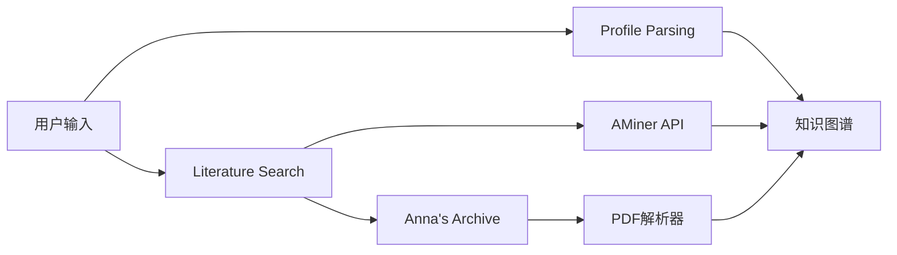
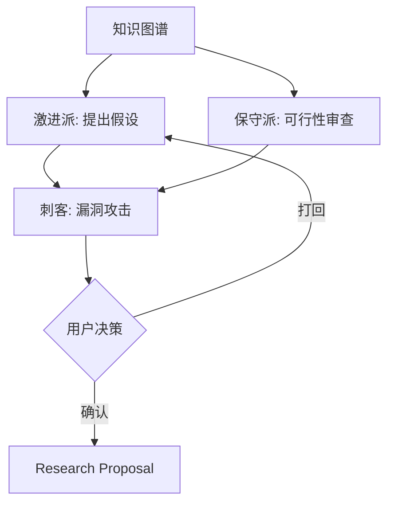
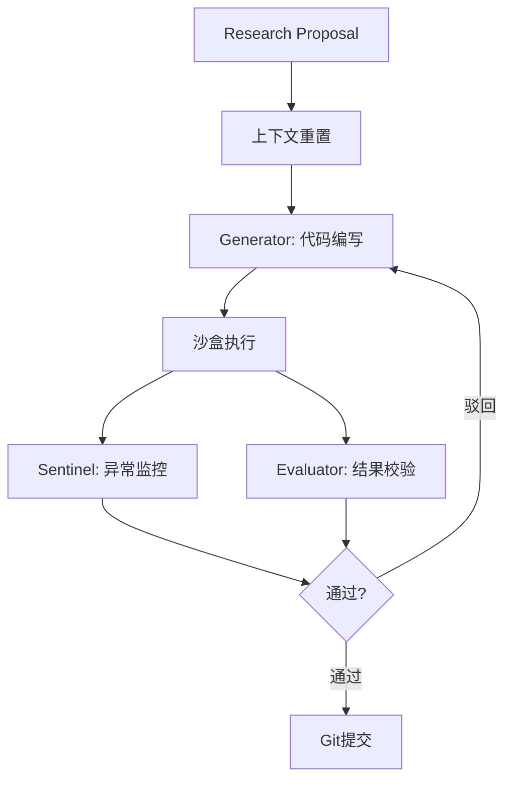
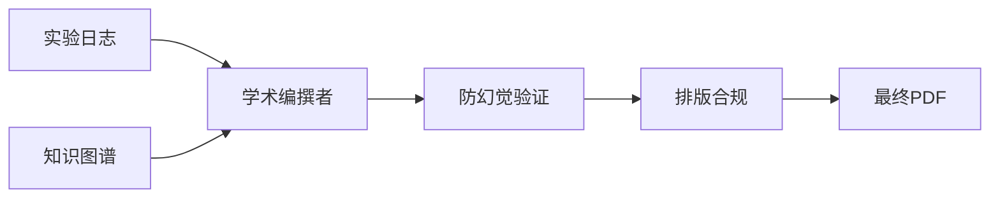

# 工作流程

## Phase 1: 数据底座与图谱初始化

**目标**：将非结构化的个人背景与海量外部学术信息融合，转化为计算机可计算的图谱结构。

### 输入

- 用户背景：学习经历、专业方向、导师流派
- 硬件限制：本地算力环境（如 Mac mini 统一内存）
- 模糊灵感：研究倾向与探索方向
- 特殊数据：独有的数据集或资源

### 执行流程



### Agent 职责

| Agent | 核心任务 | 输出 |
|-------|---------|------|
| Context Interrogator | 多轮对话提取关键实体 | User Profile JSON |
| Literature Crawler | 调用学术数据库 API 抓取文献 | 文献摘要 + 代码链接 |
| KG Builder | 抽取实体构建有向图 | 本地知识图谱 |

### 技术要点

- **AMiner API**：获取学术关系元数据、引文网络
- **Anna's Archive**：绕过付费墙获取 PDF 全文
- **OCR 解析**：Nougat/Marker 将 PDF 转为 Markdown

---

## Phase 2: 多智能体辩论与方向收敛

**目标**：通过对抗性辩论机制，产出真正具备发表价值的选题。

### 输入

- Phase 1 产出的知识图谱
- 用户的硬性约束条件

### 执行流程



### Agent 职责

| Agent | 角色 | 核心任务 |
|-------|------|---------|
| 激进派 | Hypothesis Agent | 提出 3-5 个新颖冒进的研究假设 |
| 保守派 | Sanity Agent | 审查假设在物理/数学上的自洽性 |
| 刺客 | Killer Agent | 用最严苛的审稿人视角攻击薄弱点 |

### 约束条件测试

- 评估工程实现难度
- 过滤超出硬件算力的伪需求
- 检验时间周期可行性

### 输出

- 结构化的宏观研究计划书 (Research Proposal)
- 包含：预期贡献、所需数据、风险评估

---

## Phase 3: 沙盒执行与评估闭环

**目标**：在严格隔离的沙盒环境中执行实验，通过客观评估闭环确保质量。

### 前置动作

**上下文硬重置 (Context Reset)**
- 清空前两阶段的冗杂讨论
- 仅保留 Proposal 作为唯一干净输入

### 执行流程



### Agent 职责

| Agent | 核心任务 |
|-------|---------|
| Task Decomposer | 将研究方向拆解为 DAG 形式的实验步骤 |
| Generator | 编写实验代码，配置运行环境 |
| Sentinel | 监控数值异常（NaN/Inf），熔断并触发 Debug |
| Evaluator | 读取真实探针数据，客观评估结果 |

### 探针监控指标

- Loss 曲线斜率
- 张量分布
- 资源使用率
- 收敛状态

### FARS 机制

- 所有运行日志强制 Commit 入库
- 每一次试错都有版本记录
- 过程可回溯、可审计

---

## Phase 4: 防幻觉论文编撰

**目标**：基于真实数据产出符合学术规范的论文。

### 输入

- Git 仓库中的真实实验日志
- Phase 1 图谱中的真实文献

### 执行流程



### 防幻觉机制

1. **引用验证**：仅允许引用知识图谱中真实存在的文献
2. **数据验证**：图表必须来源于真实运行日志
3. **URL 检查**：所有引用链接必须返回 200

### Agent 职责

| Agent | 核心任务 |
|-------|---------|
| Academic Writer | 自底向上撰写论文，确保逻辑链条完整 |
| QA & Formatter | LaTeX 格式转换、BibTeX 处理、图表校验 |

### 输出

- Ready-to-Submit 的 PDF 终稿
- 目标格式：NeurIPS / ICML / 期刊模板

---

## 状态机流转规则

```
Phase 1 ──[校验点]──> Phase 2 ──[校验点]──> Phase 3 ──[校验点]──> Phase 4
    ↑                    ↑                    ↑
    └──── 回滚 ──────────┴──── 回滚 ──────────┘
```

### 校验断言

- JSON 格式正确性
- 引用 URL 可达性
- 实验数据完整性
- 收敛状态判定

### 回滚策略

- 断言失败 → 触发快照回滚
- 携带报错日志
- 调整参数或更换种子重新生成
